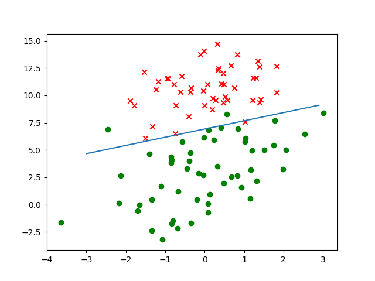
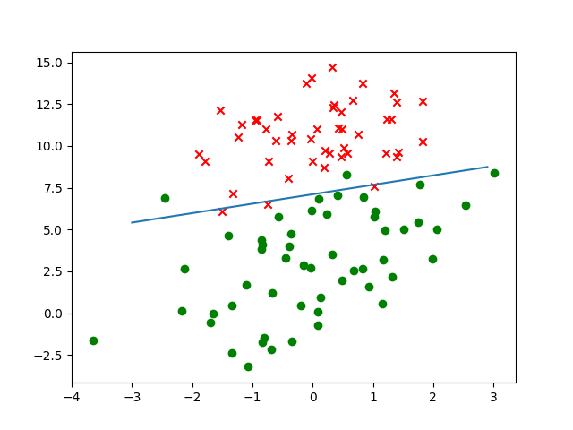

# Logistic 回归
（据说中文其实不是“逻辑回归”）

## 原理
书中使用 Logistic 回归解决二分类问题。设两种类别分别为 0 和 1，Logistic 回归认为样本属于类别 1 的概率 。其中 ， 是一个行向量，表示一个样本的各种特征的值。为了方便起见，设常数项。 是一个列向量，表示每种特征对结果的“权重”。

设共有  个训练样本，每个样本有  种特征。设 ，Logistic 回归认为所有训练样本的代价函数为

如果和线性回归一样取平方函数做代价函数，会导致代价函数非凸，不好优化。

使用梯度下降法优化代价函数。把  展开，尝试对代价函数中的某一个变量  求导，会发现非常漂亮的结果。

 

相加即可得到代价函数的梯度

是一个非常漂亮的梯度，用它来做梯度下降和随机梯度下降即可。

## 应用

在两个特征的训练集上，分类结果看起来非常不错。

^ 普通梯度下降结果

^ 随机梯度下降结果

不过在病马的数据集上准确率只有 77% 上下，按书中的说法是由于部分数据的部分特征缺失，用特殊值补进去的结果...
